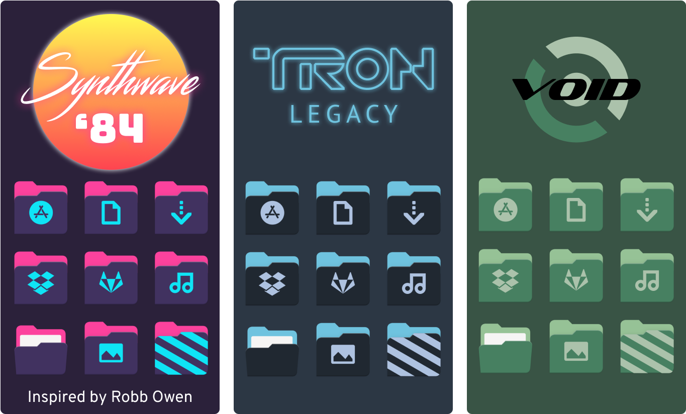
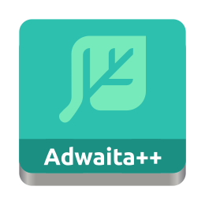
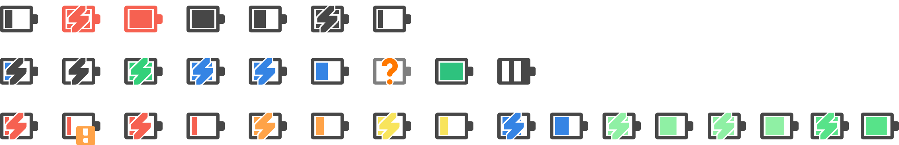
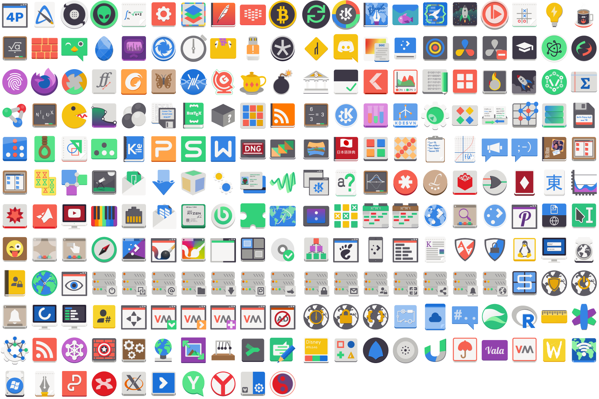
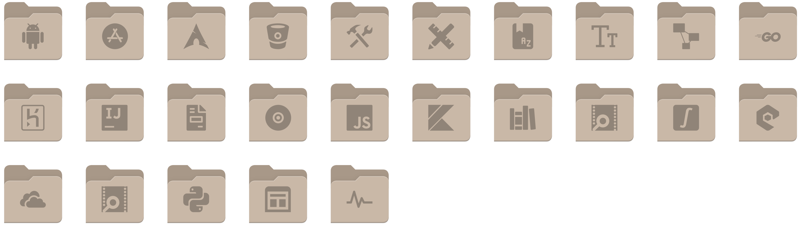
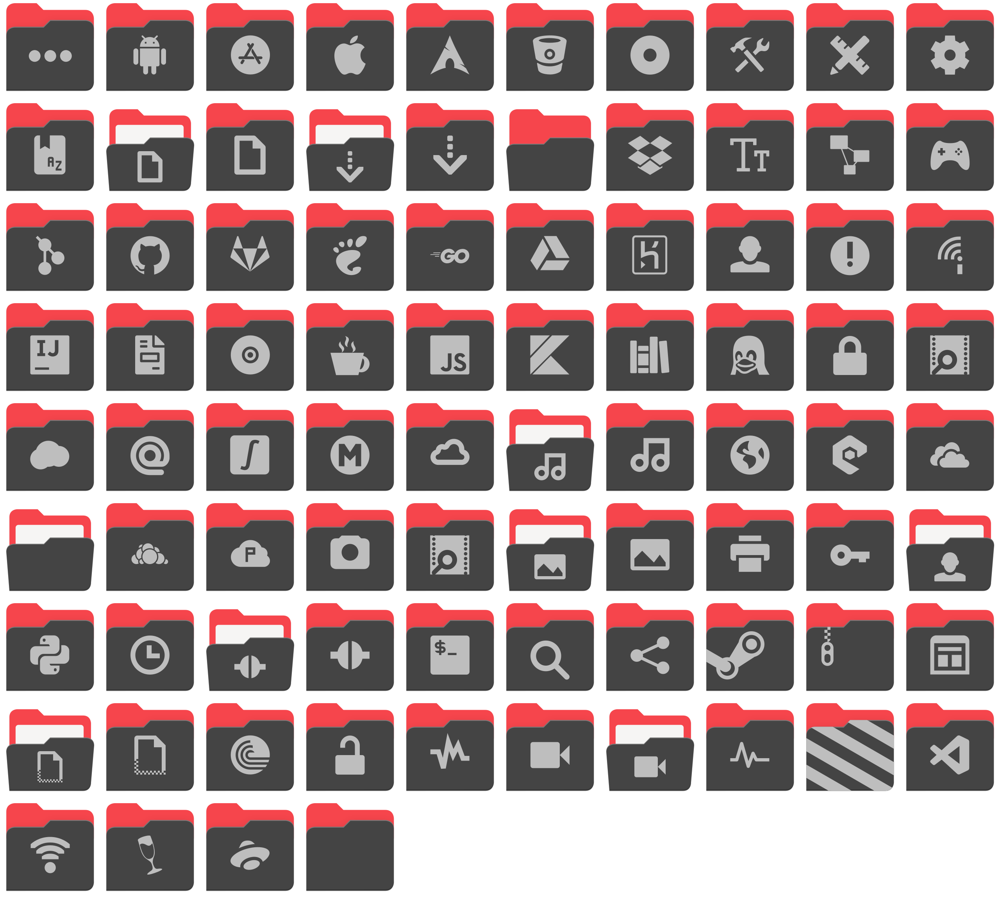

# Version 6.0 – Bauhinia variegata

  
English

  - New Adwaita++ folders styles: Synthwave ‘84, inspired by [Robb Ownen](https://github.com/robb0wen)'s [VSCode's Synthwave '84 theme](https://marketplace.visualstudio.com/items?itemName=RobbOwen.synthwave-vscode), TRON and Void Linux:

  

  - Fuzziness of battery icons have been fixed (#34);

  <h2>New additions</h2>

  - Catfish (#38)
  - Compton (#38)
  - Figma (#38)
  - Fish (#38)
  - Fontforge (#38)
  - Glimpse
  - iPython (#38)
  - jgmenu (#38)
  - Kipi (#38)
  - Kitty (#38)
  - Kvantum (#38)
  - Microsoft Edge
  - Minecraft (#36)
  - Nitrogen (#38)
  - Nvim (#38)
  - Qalculate (#38)
  - Reaper (#36)
  - RFB (#38)
  - Signal Desktop (#38)
  - SQlite Browser (#38)
  - Swappy (#38)
  - Sxiv(#38)
  - Tor Browser (#38)
  - XFCE Clipman Plugin (#38)
  - XFCE Panel (#38)
  - Yad (#38)

  <h2>Updates and upgrades</h2>

  - Apps
    - Accessibility
    - Applications (GNOME Software, Ubuntu Software, etc.)
    - Asunder
    - Audex
    - Blender
    - Brasero
    - Calculator
    - Cheese
    - Currency (generic icon)
    - Devede
    - DVD95
    - DVDRip
    - DVDStyler
    - Epiphany
    - GNOME Tetravex
    - Goobox
    - GThumb
    - GTKPod
    - Image Viewer (generic icon)
    - Imagination
    - K3B
    - Keepassxc
    - Kid3
    - Kodi
    - Livepatch
    - Meld
    - Preferences Desktop Personal Directory
    - Preferences System Login
    - Rhythmbox
    - Ripperx
    - RSS
    - Shotwell
    - Sound Juicer
    - SoundConverter
    - User (generic icon)
    - Vim
    - xfburn
  - Devices:
    - gnome-dev-printer-new
    - media-flash-memory-stick
    - printer
  - Mimetypes
    - application-x-firmware
    - application-x-sharedlib
    - extension
  - Places:
    - user-trash-full
    - user-trash

  - Under the user’s demand, Adwaita++ Dark Colorful has been added (#37).

  
Italiano

  - Nuovi stili di cartelle di Adwaita++: Synthwave '84, ispirato dal [tema Synthwave '84 di VSCode](https://marketplace.visualstudio.com/items?itemName=RobbOwen.synthwave-vscode) del [Robb Ownen](https://github.com/robb0wen), TRON e Void Linux:

  

  - La confusione di icone della batteria è stata corretta (#34);

  <h2>Nuove aggiunte</h2>

  - Catfish (#38)
  - Compton (#38)
  - Figma (#38)
  - Fish (#38)
  - Fontforge (#38)
  - Glimpse
  - iPython (#38)
  - jgmenu (#38)
  - Kipi (#38)
  - Kitty (#38)
  - Kvantum (#38)
  - Microsoft Edge
  - Minecraft (#36)
  - Nitrogen (#38)
  - Nvim (#38)
  - Panello di XFCE (#38)
  - Qalculate (#38)
  - Reaper (#36)
  - RFB (#38)
  - Signal Desktop (#38)
  - SQlite Browser (#38)
  - Swappy (#38)
  - Sxiv(#38)
  - Tor Browser (#38)
  - XFCE Clipman Plugin (#38)
  - Yad (#38)

  <h2>Aggiornate</h2>

  - Applicazioni
    - Accessibilità
    - Applicazioni (GNOME Software, Ubuntu Software, etc.)
    - Asunder
    - Audex
    - Blender
    - Brasero
    - Calculatore
    - Cheese
    - Devede
    - DVD95
    - DVDRip
    - DVDStyler
    - Epiphany
    - GNOME Tetravex
    - Goobox
    - GThumb
    - GTKPod
    - Image Viewer (Icona generica)
    - Imagination
    - K3B
    - Keepassxc
    - Kid3
    - Kodi
    - Livepatch
    - Meld
    - Moneta (Icona generica)
    - Preferenze di directory personale di desktop
    - Preferenze di sessione di sistema
    - Rhythmbox
    - Ripperx
    - RSS
    - Shotwell
    - Sound Juicer
    - SoundConverter
    - Utente (icona generica)
    - Vim
    - xfburn
  - Dispositivi:
    - gnome-dev-printer-new
    - media-flash-memory-stick
    - printer
  - Tipi di file
    - application-x-firmware
    - application-x-sharedlib
    - extension
  - Cartelle:
    - user-trash-full
    - user-trash

  - Sotto la domanda dell'utente, è stato aggiunto il nuovo tema Adwaita++ Scuro Colorato (#37).

  
Português

  - Novos estilos de pastas de Adwaita++: Synthwave ‘84, inspirado pelo [tema Synthwave ‘84 do VSCode](https://marketplace.visualstudio.com/items?itemName=RobbOwen.synthwave-vscode) do [Robb Ownen](https://github.com/robb0wen), TRON e Void Linux:

  

  - O desofque dos ícones da bateria foi corrigido (#34);

  <h2>Novas adições</h2>
  
  - Catfish (#38)
  - Compton (#38)
  - Figma (#38)
  - Fish (#38)
  - Fontforge (#38)
  - Glimpse
  - iPython (#38)
  - jgmenu (#38)
  - Kipi (#38)
  - Kitty (#38)
  - Kvantum (#38)
  - Microsoft Edge
  - Minecraft (#36)
  - Nitrogen (#38)
  - Nvim (#38)
  - Qalculate (#38)
  - Reaper (#36)
  - RFB (#38)
  - Signal Desktop (#38)
  - SQlite Browser (#38)
  - Swappy (#38)
  - Sxiv(#38)
  - Tor Browser (#38)
  - XFCE Clipman Plugin (#38)
  - XFCE Panel (#38)
  - Yad (#38)

  <h2>Atualizações.</h2>

  - Aplicativos
    - Acessibilidade
    - Applicativos (GNOME Software, Ubuntu Software, etc.)
    - Asunder
    - Audex
    - Blender
    - Brasero
    - Calculator
    - Cheese
    - Devede
    - DVD95
    - DVDRip
    - DVDStyler
    - Epiphany
    - GNOME Tetravex
    - Goobox
    - GThumb
    - GTKPod
    - Imagination
    - K3B
    - Keepassxc
    - Kid3
    - Kodi
    - Livepatch
    - Meld
    - Moeda (ícone genérico)
    - Preferências de diretório pessoal de desktop
    - Preferências de sessão do sistema
    - Rhythmbox
    - Ripperx
    - RSS
    - Shotwell
    - Sound Juicer
    - SoundConverter
    - Usuário (ícone genérico)
    - Vim
    - Visualizador de Imagens (ícone genérico)
    - xfburn
  - Dispositivos:
    - gnome-dev-printer-new
    - media-flash-memory-stick
    - printer
  - Tipos de arquivos
    - application-x-firmware
    - application-x-sharedlib
    - extension
  - Pastas:
    - user-trash-full
    - user-trash

  - Sob a demanda do usuário, Adwaita++ Escuro Colorido foi adicionado (#37).

# Version 5.0 – Paubrasilia echinata

  
English

  From the version 5.0, each new version of Adwaita++ icons theme will be named after a tree or wood name in Latin. 

  * New Adwaita++ logotype, based on GNOME Project's original Adwaita icons theme logotype:

    

  * @gusbemacbe has upgrade the new battery design that GNOME Project developers did not upgrade for a decade!

    

  * Increased from 2170 to 3009 apps icons!
  * @gusbemacbe has completed the full support for KDE and made more than 2 thousand beautiful Breeze icons in pure Adwaita++ style!

    

  * Added new 23 places icons:

    

    
    * Android
    * Applications
    * AUR
    * Bitbucket
    * Configurations (for example: `.config`)
    * Design
    * Dictionaries
    * Fonts
    * FreeDesktop
    * Go programming language
    * Heroku
    * Intellij IDEA
    * Invoices
    * ISOs
    * JavaScript
    * Kotlin
    * Library
    * Logs
    * Maths
    * Nodejs
    * OneDrive
    * PHP
    * Python
    * Templates
    * VirtualBox
    * VSCode

  * A new colour of places icons, inspired by the latest Yaru’s places icons:

    

  
Italiano

  Dalla versione 5.0, ogni nuova versione del tema delle icone di Adwaita++ avrà il nome di albero o legno in latino.

  * Nuovo logotipo dell'Adwaita++, basato sul logotipo originale del tema delle icone Adwaita del Progetto GNOME:

    

  * @gusbemacbe ha aggiornato il nuovo design di nuova batteria che gli sviluppatori del Progetto GNOME non hanno aggiornato per un decennio!

    

  * Aumentato da 2170 a 3009 icone di applicazioni!
  * @gusbemacbe ha completato il supporto completo per KDE e realizzato oltre 2 mila bellissime icone di KDE Breeze in puro stile di Adwaita++!

    

  * Aggiunte nuove 23 icone di cartelle:

    

    
    * Android
    * Applicazioni
    * AUR
    * Biblioteca
    * Bitbucket
    * Configurazioni/Impostazioni (ad esempio: `.config`)
    * Design
    * Dizionari
    * Fatture
    * Font
    * FreeDesktop
    * Heroku
    * Intellij IDEA
    * ISO
    * JavaScript
    * Kotlin
    * Linguaggio di programmazione GO
    * Log
    * Matematiche
    * Nodejs
    * OneDrive
    * PHP
    * Python
    * Template
    * VirtualBox
    * VSCode

  * Un nuovo colore delle icone delle cartelle, ispirato alle nuove icone di cartelle della ultimissima versione di Yaru del Canonical:

    

  
Português brasileiro

  A partir da versão 5.0, cada nova versão do tema de ícones Adwaita++ terá o nome de árvore ou madeira em latim.

  * Novo logotipo do Adwaita++, baseado no logotipo original do tema de ícones Adwaita do Projeto GNOME:

    

  * O @gusbemacbe atualizou o novo *design* da bateria que os desenvolvedores do Projeto GNOME não atualizaram há uma década!

    

  * Aumentou de 2170 para 3009 ícones de aplicativos!
  * O @gusbemacbe concluiu o suporte completo ao KDE e criou mais de 2 mil ícones bonitos do KDE Breeze no puro estilo de Adwaita++!

    

  * Adicionados 23 novos ícones de pasta:

    

    
    * Android
    * Aplicativos
    * AUR
    * Biblioteca
    * Bitbucket
    * Boletos/faturas
    * Configurações (por exemplo: `.config`)
    * *Design*
    * Dicionários
    * Fontes
    * FreeDesktop
    * Heroku
    * Intellij IDEA
    * ISOs
    * JavaScript
    * Kotlin
    * Linguagem de programação GO
    * Log
    * Matemática
    * Modelos
    * Nodejs
    * OneDrive
    * PHP
    * Python
    * VirtualBox
    * VSCode

  * Uma nova cor dos ícones de pastas, inspirada nos novos ícones de pasta da versão mais recente do Yaru da Canonical:

    

